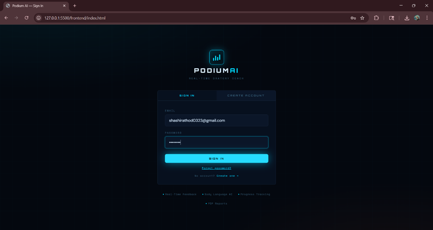
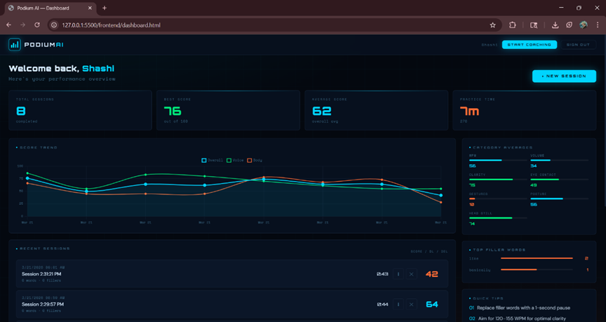
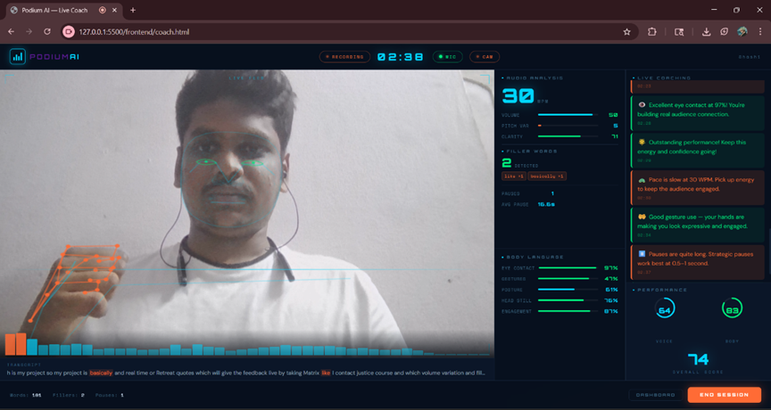
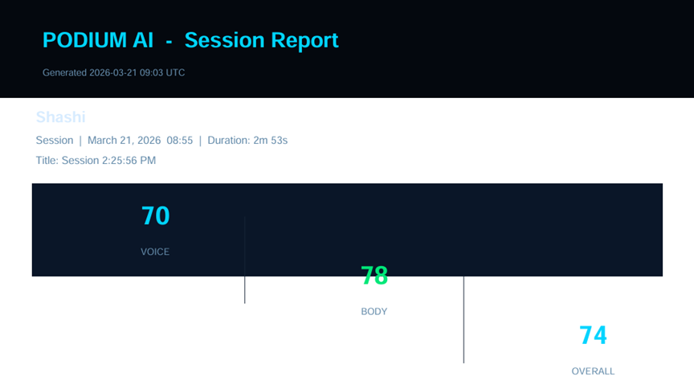
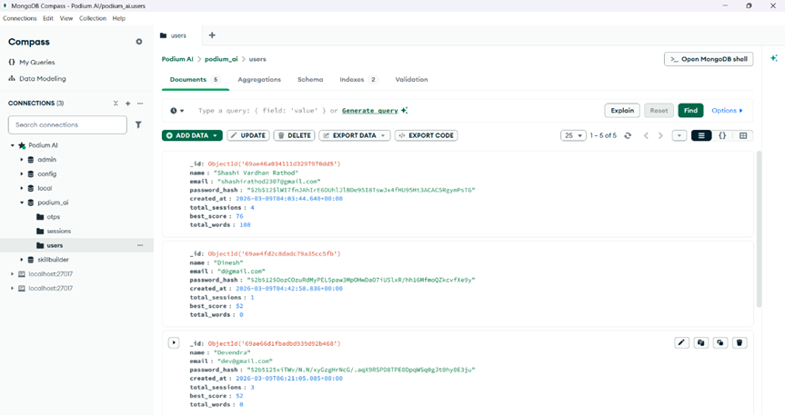

# PODIUM AI — Real-Time Oratory Coach
### Major Project | Python + FastAPI + MongoDB + Vanilla JS

---

## Project Structure

```
podium-ai/
├── backend/
│   ├── main.py                  ← FastAPI app entry point
│   ├── config.py                ← MongoDB connection + JWT settings
│   ├── requirements.txt         ← Python dependencies
│   ├── .env                     ← Environment variables (edit this)
│   ├── models/
│   │   ├── user.py              ← User Pydantic models
│   │   └── session.py           ← Session data models
│   ├── routes/
│   │   ├── auth.py              ← Register / Login / Me
│   │   ├── sessions.py          ← Session CRUD
│   │   ├── analytics.py         ← Dashboard chart data
│   │   └── reports.py           ← PDF download
│   ├── services/
│   │   ├── feedback_engine.py   ← 20-rule coaching logic
│   │   └── pdf_generator.py     ← Session PDF reports
│   └── ws/
│       └── coach.py             ← WebSocket session handler
└── frontend/
    ├── index.html               ← Login / Signup page
    ├── dashboard.html           ← User performance dashboard
    ├── coach.html               ← Live coaching interface
    ├── css/
    │   ├── base.css             ← Design system (variables, shared)
    │   ├── auth.css             ← Auth page styles
    │   ├── dashboard.css        ← Dashboard styles
    │   └── coach.css            ← Coach interface styles
    └── js/
        ├── api.js               ← HTTP + WebSocket client (JWT)
        ├── auth.js              ← Login/Signup controller
        ├── audio.js             ← Web Audio API analysis
        ├── speech.js            ← Speech recognition (fixed popup bug)
        ├── mediapipe.js         ← Face/hand/pose detection
        ├── coach.js             ← Session orchestrator
        └── dashboard.js         ← Dashboard data + charts
```

---

## Setup Instructions

### 1. Prerequisites
- Python 3.11+
- MongoDB running locally (`mongod`)
- Modern browser (Chrome/Edge for Speech API)
- Live Server extension (VS Code) **or** any static file server

---

### 2. Backend Setup

```bash
cd backend

# Create virtual environment
python -m venv venv
source venv/bin/activate        # Windows: venv\Scripts\activate

# Install dependencies
pip install -r requirements.txt

# Edit .env if needed (defaults work for local MongoDB)
# MONGO_URI=mongodb://localhost:27017
# DB_NAME=podium_ai
# JWT_SECRET=change-this-to-a-random-string

# Start the server
uvicorn main:app --reload --port 8000
```

Backend runs at: **http://localhost:8000**
API docs at:     **http://localhost:8000/docs**

---

### 3. Frontend Setup

Open `frontend/` with **VS Code Live Server** (right-click `index.html` → Open with Live Server).

Runs at: **http://127.0.0.1:5500**

> **Important:** Open in **Chrome or Edge** — Firefox does not support the Web Speech API.

---

### 4. First Run

1. Open `http://127.0.0.1:5500/index.html`
2. Create an account via the Register tab
3. You'll be redirected to your Dashboard
4. Click **START COACHING** → allow camera + microphone
5. Speak naturally — feedback appears within 3 seconds

---

## Output Screens

**Login / Sign Up**



`POST /auth/login` verifies the bcrypt hash and returns a 7-day JWT stored in `localStorage`. New users register with OTP email verification before being redirected to the dashboard.

---

**Performance Dashboard**



Aggregates up to 200 sessions server-side. The Chart.js trend chart plots the last 20 sessions; category averages and filler word totals render as progress bars.

---

**Live Coaching Interface**



Every 500 ms the browser sends a metrics frame over WebSocket. The server evaluates 20 rules with per-rule cooldowns and streams back scores + feedback in real time. Filler words are highlighted in orange in the live transcript.

---

**PDF Session Report**



Generated with `fpdf2`. Scores are colour-coded by tier (green ≥ 75, cyan 50–74, orange < 50), followed by audio/video metric bars, a timestamped feedback log, and a transcript snippet.

---

**MongoDB — Database Overview**



Three collections: `users`, `sessions`, and `otps` (auto-deleted after 10 min via TTL index). All session metrics are persisted in a single `$set` at session end.

---

## API Endpoints

| Method | Path | Description |
|--------|------|-------------|
| POST | `/auth/register` | Create account |
| POST | `/auth/login` | Login, get JWT |
| GET  | `/auth/me` | Current user profile |
| POST | `/sessions/` | Create new session |
| GET  | `/sessions/` | List user sessions |
| GET  | `/sessions/{id}` | Get single session |
| DELETE | `/sessions/{id}` | Delete session |
| GET  | `/analytics/overview` | Dashboard stats + chart data |
| GET  | `/reports/{id}/pdf` | Download PDF report |
| WS   | `/ws/coach/{id}?token=JWT` | Real-time coaching socket |

---

## WebSocket Protocol

**Browser → Server (every 500ms):**
```json
{
  "type": "metrics",
  "audio": { "wpm": 145, "volume": 42, "pitch": 55, "clarity": 80,
             "fillers": 2, "filler_map": {"um": 2}, "pauses": 3,
             "avg_pause_ms": 800, "words": 120, "speaking": true },
  "video": { "eye": 75, "gesture": 22, "posture": 88,
             "head": 90, "engage": 80, "frames": 240, "face_on": true }
}
```

**Server → Browser:**
```json
{
  "type": "scores",
  "scores": { "voice": 78, "body": 65, "overall": 72 },
  "feedback": {
    "text": "Great pace at 145 WPM!",
    "type": "positive",
    "icon": "✓",
    "timestamp_s": 34
  }
}
```

**End session:**
```json
{ "type": "end", "data": { "transcript": "…full session text…" } }
```

---

## Speech Recognition Fix

The repeated microphone permission popup in the original version was caused by creating a **new `SpeechRecognition` instance** every time recognition stopped.

**The fix** (in `js/speech.js`):
- Create `SpeechRecognition` **once** and never recreate it
- On `onend`, simply call `.start()` on the **same instance**
- Media permissions are granted once via `getUserMedia` at session start

---

## Tech Stack

| Layer | Technology |
|-------|-----------|
| Backend | Python 3.11, FastAPI, Uvicorn |
| Database | MongoDB (via Motor async driver) |
| Auth | JWT (python-jose) + bcrypt |
| Real-time | WebSockets (FastAPI native) |
| PDF | fpdf2 |
| Frontend | Vanilla HTML/CSS/JS |
| Vision AI | MediaPipe Holistic (CDN) |
| Audio | Web Audio API (browser native) |
| Speech | Web Speech API (browser native) |
| Charts | Chart.js 4 |
| Fonts | Orbitron, Space Mono, DM Sans |

---

## Features

- ✅ **Login / Signup** with JWT authentication
- ✅ **Real-time speech analysis** — WPM, volume, pitch, clarity, filler words, pauses
- ✅ **Live body language tracking** — eye contact, gestures, posture, head stability
- ✅ **20-rule feedback engine** with per-rule cooldowns
- ✅ **WebSocket streaming** — metrics sent every 500ms, feedback returned instantly  
- ✅ **Session persistence** in MongoDB
- ✅ **Performance dashboard** with trend charts, category averages, filler word analysis
- ✅ **PDF report download** per session
- ✅ **User progress tracking** across sessions

---

*Built for Major Project submission — Podium AI v1.0*
